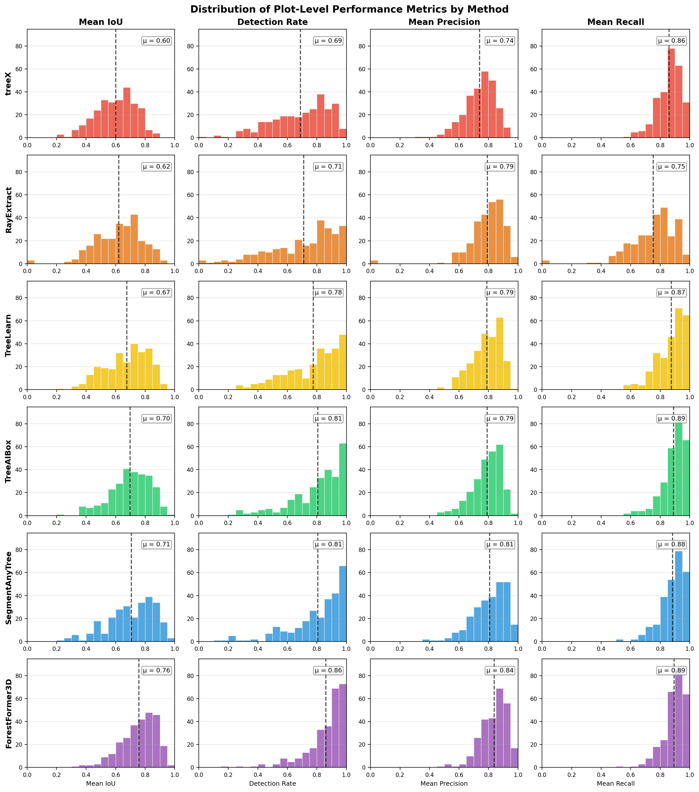
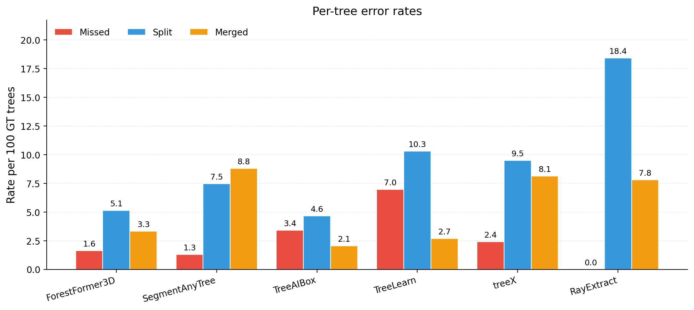
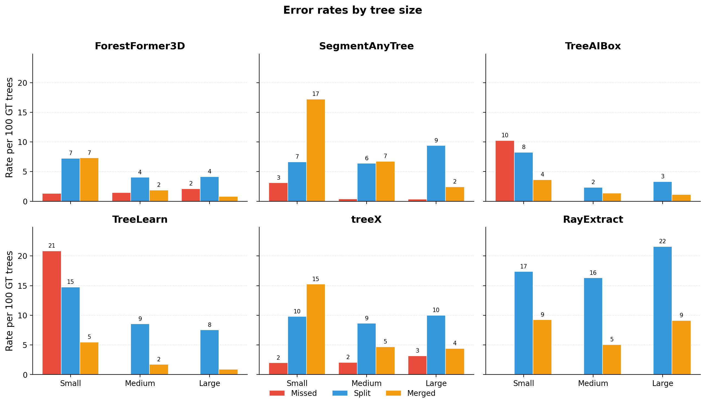

# Understanding the visualizations

This guide explains the main visualizations used in the paper and generated by
`tlseval report`. The examples below show the published benchmark results. A
report for a new method uses the same metrics and failure definitions.

## Performance distributions

Each panel shows how a metric varies across plots. Values farther to the right
indicate better performance, and the dashed line marks the mean. The width of
the distribution indicates where plot results are concentrated. A long left
tail identifies plots on which performance decreases substantially.

Compare methods within the same metric. IoU, detection rate, precision, and
recall measure different aspects of performance and should not be compared
directly with one another.

## Failure frequencies

The bars report events per 100 reference trees. Lower values indicate fewer
failures. The three categories describe different errors:

- **Missed:** most points of a reference tree are assigned to background.
- **Split:** part of a reference tree forms an additional prediction.
- **Merged:** a reference tree is absorbed into the prediction of a taller tree.

The categories are independent. A tree can receive more than one flag, so the
three bars do not sum to 100.

## Failure frequencies by tree size

This figure uses the same failure rates after dividing reference trees into
three height classes. Compare the bars for one method and failure category
across the Small, Medium, and Large panels. Large differences indicate that an
error is concentrated in a particular size class.

Rates are normalized within each size class. They describe relative frequency,
not the absolute number of affected trees.

## Figures generated by `tlseval report`

| File | How to read it |
|---|---|
| `01_metric_distributions.png` | Distribution of each metric across plots; the vertical line marks the mean. |
| `02_attribute_sensitivity.png` | Spearman correlation between each plot attribute and mean IoU. The sign gives the direction and the magnitude gives the strength of the association. |
| `03_strongest_predictors.png` | Plot-level relationship between mean IoU and the four attributes with the strongest correlations. Each point represents one plot. |
| `04_easy_vs_hard.png` | Standardized attribute differences between the lowest- and highest-performing plot quartiles. |
| `05_stratified_2x2.png` | Mean IoU for combinations of low or high canopy complexity and species diversity. Each cell also reports the number of plots. |
| `06_failures_and_size.png` | Failure frequencies per 100 reference trees and mean IoU by reference-tree size class. |
| `07_vs_published.png` | Mean IoU for the new method and published methods on their shared plots. Statistical comparisons are reported in the accompanying table. |

Correlations and group differences describe associations in the evaluation
data; they do not establish causal effects.
